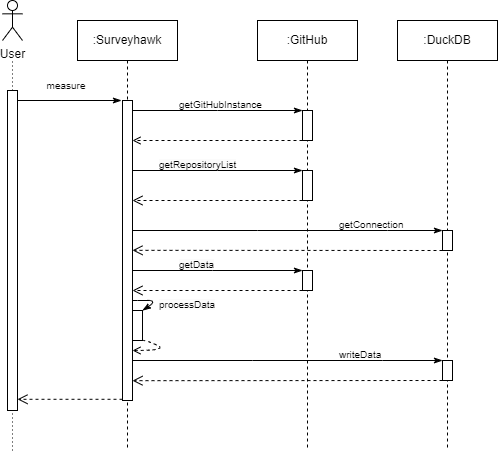
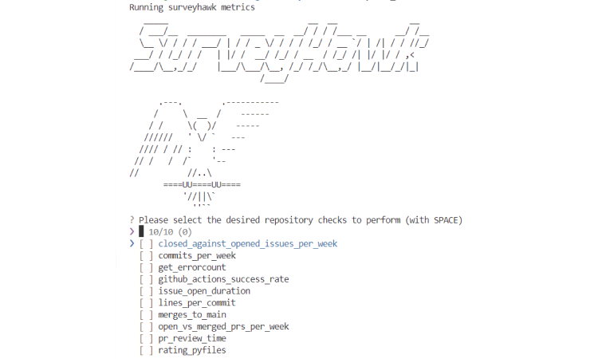

# Features

---

## 1. **`measure`**: Daten erfassen

#### Argumente
- **`-q` (query)**:
  - **Beispiel**: `surveyhawk measure -q "topic:python"`

- **`-i` (interactive)**:
  - **Beispiel**: `surveyhawk measure -i`

- **`-p` (public)**:
  - **Beispiel**: `surveyhawk measure -p`

---

## 2. **`metrics`**: Metriken analysieren

#### Argumente
- **`-q` (query)**:
  - **Beispiel**: `surveyhawk metrics -q "language:python"`

- **`-i` (interactive)**:
  - **Beispiel**: `surveyhawk metrics -i`

- **`-p` (public)**:
  - **Beispiel**: `surveyhawk metrics -p`

- **`-v` (visualize)**: 
  - **Beispiel**: `surveyhawk metrics -v`

---

## 3. **`predicates`**: Qualitative Eigenschaften bewerten

#### Argumente
- **`-q` (query)**:
  - **Beispiel**: `surveyhawk predicates -q "topic:devops"`

- **`-p` (public)**:
  - **Beispiel**: `surveyhawk metrics -p`

- **`-i` (interactive)**:
  - **Beispiel**: `surveyhawk predicates -i`

---

#### [--> 🔎 Beispielmetriken Surveyhawk](../Guide/Health-Checks/Metrics.md)

<!-- ## Video-Anleitung

Hier finden Sie ein anschauliches Video, das die Bedienung von Surveyhawk Schritt für Schritt erklärt:

*Hinweis: Klicken Sie auf das Bild, um das Video auf YouTube zu öffnen.* -->

