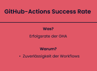
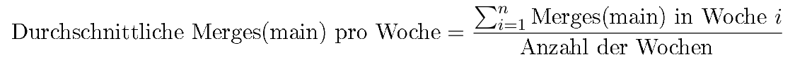

# Metrics 

**Metriken sind der Schlüssel zur Bewertung der Repository-Gesundheit. Sie liefern klare Einblicke in die Effizienz, Qualität und Aktivität eines Projekts.**

---

## 🔥 **Aktivitätsmetriken**

---

## 💎 **Qualitätsmetriken**

---

## 🔄 **Workflow-Metriken**

---
## **Beispielrechnung einer Metrik**

#### [--> Ergebnisse](../../Results/Results.md)