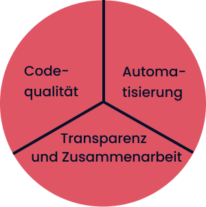
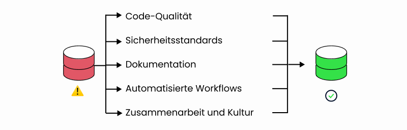

# Grundlagen der Repository-Gesundheit

<!--  -->

---
### Wie erreiche ich ein gesundes Repository?

 
---

### DevOps Praktiken unterstützen Repository-Gesundheit

---

<!-- ### Wieso ist ein gesundes Repository erstrebenswert?

 -->
<!-- ### Wie wirkt sich ein Gesundes Repository auf den Projekterfolg aus?

1. **Schnellere Bereitstellung ⚡**: Änderungen können effizient und fehlerfrei umgesetzt werden.  
2. **Höhere Qualität 💎**: Fehler und Schwachstellen werden frühzeitig erkannt und behoben.  
3. **Bessere Zusammenarbeit 👩‍💻👨‍💻**: Entwicklerteams können effektiver arbeiten, da Prozesse klar definiert und optimiert sind.  
4. **Stabilität und Sicherheit 🛡️**: Gut gepflegte Repositories minimieren Risiken und gewährleisten langfristige Zuverlässigkeit.   -->

---

> <!-- Kommentar: Das Three Ways Modell unterstützt die Repository-Gesundheit direkt. "Flow" sorgt für Effizienz, "Feedback" für Qualität und schnelle Reaktion, während "Continuous Learning" nachhaltige Verbesserungen ermöglicht. Diese Prinzipien sind essenziell für die Messung und Optimierung der Metriken und Workflows. -->

<!-- ### **Zentrale Aspekte eines gesunden Repositories**:
- **Code-Qualität und Wartbarkeit**: Der Code ist lesbar, verständlich und leicht zu ändern.
- **Sicherheitsstandards**: Einhaltung von Sicherheitsrichtlinien, um Risiken zu minimieren.
- **Konsistente Dokumentation**: Verständliche und aktuelle Dokumentationen.
- **Automatisierte Workflows**: CI/CD und andere automatisierte Prozesse fördern Effizienz.

---

## Warum ist Repository Health wichtig?

Die Repository-Gesundheit beeinflusst direkt:
1. **Wartbarkeit**: Gut strukturierte und dokumentierte Repositories sind einfacher zu pflegen.
2. **Effizienz**: Automatisierte Workflows reduzieren manuelle Fehler.
3. **Stabilität**: Hochwertiger Code minimiert Ausfälle und Bugs.
4. **Sicherheit**: Einhaltung von Standards schützt vor Schwachstellen. -->

<!-- ---
## Schlüsselparameter für die Repository-Gesundheit

### Aktivitätsmetriken
- **Deployment Frequency**: Häufigkeit der Bereitstellung neuer Versionen.
- **Problemalter (Issue Spoilage)**: Wie lange bleiben Probleme ungelöst?  
- **Commit-Häufigkeit**: Gibt Einblick in die Dynamik eines Projekts.

### Qualitätsmetriken
- **Change Failure Rate**: Wie häufig führen Änderungen zu Fehlern?
- **Code-Komplexität**: Wie einfach ist der Code zu verstehen und zu testen?
- **Testabdeckung**: Wie viel Prozent des Codes wird durch Tests abgedeckt?

### Workflowmetriken
- **Time to Restore Service**: Zeit, um Ausfälle zu beheben.
- **Lead Time**: Zeit von der ersten Änderung bis zur Bereitstellung.
- **GitHub Actions Success Rate**: Stabilität der CI/CD-Pipelines.

--- -->

# OSS vs CSS

| **Aspekt**             | **OSS** 🌐                        | **CSS** 🔒                       |
|------------------------|----------------------------------------------------------|----------------------------------------------------------|
| **Zugänglichkeit**      | Jeder                                  | Privat                     |
| **Aktivität**           | Hoch     | Gering                              |
| **Nutzerbasis**         | Abhängig von einer aktiven Community.                   |Intern begrenzt                           |
| **Teamstruktur**        | Community-getrieben, wechselnde Mitwirkende.            | Feste Entwicklergruppe mit klaren Rollen.                |
| **Sicherheitsansatz**   | Sicherheit durch Community-Beteiligung.                 | Geschlossene Entwicklung und begrenzter Zugriff.         |

---

#### [--> 💻 Wie funktioneirt Surveyhawk?](../Guide/Features.md)

<!-- Kommentar: Die Kombination aus Best Practices (Three Ways), Messung (Metriken) und Teamkultur schafft eine ganzheitliche Sicht auf die Repository-Gesundheit. Diese Ansätze sind nicht isoliert, sondern wirken zusammen, um die Effizienz und Qualität von Repositories nachhaltig zu verbessern. -->