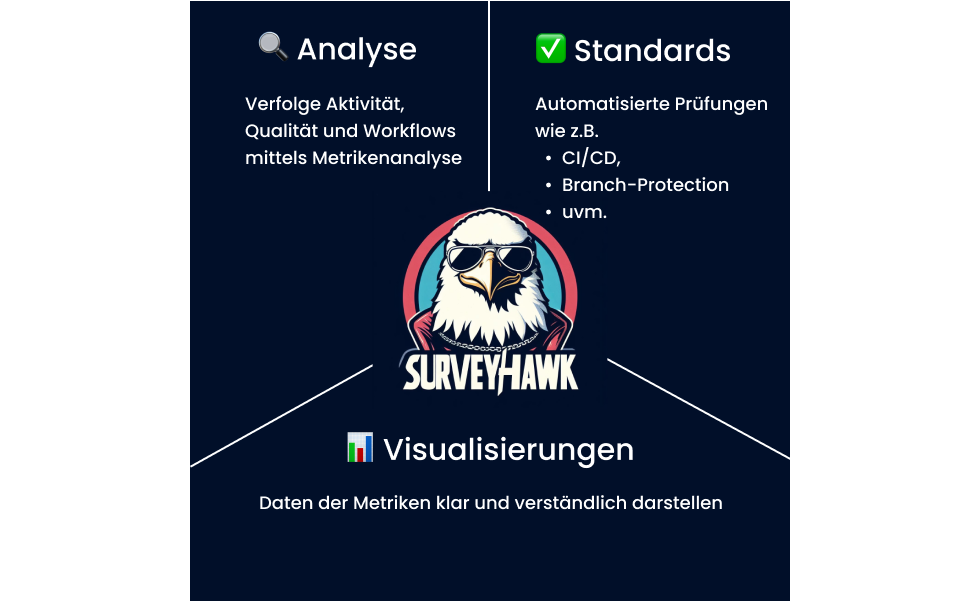

# Introduction

---

### **Die Herausforderungen:**
❌ Ineffiziente Prozesse bremsen die Softwareentwicklung aus  
❌ Qualitätsdefizite werden erst spät erkannt  
❌ Unzureichende Automatisierung  
❌ Mangelnde Sicherheit 

---
  
> 1. Entwicklung einer **systematischen Methode zur kontinuierlichen Bewertung der Repository-Gesundheit**
> 2. Untersuchen der **Unterschiede in der Bewertung und Pflege** zwischen **Open-Source-Software (OSS)** und **Closed-Source-Software (CSS)**

---

---

#### [--> 📚 Grundlagen der Repository-Gesundheit](Foundations.md)
