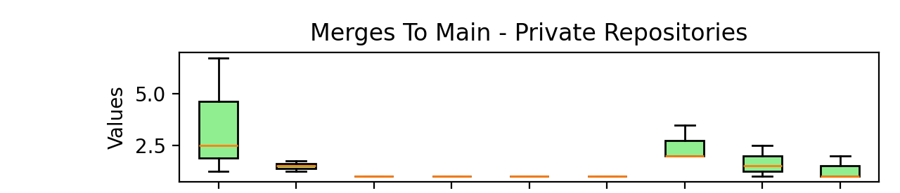
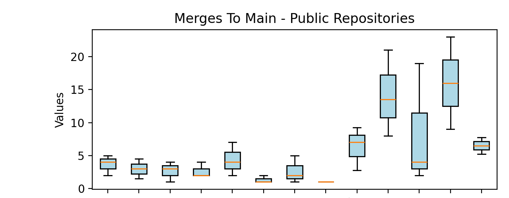
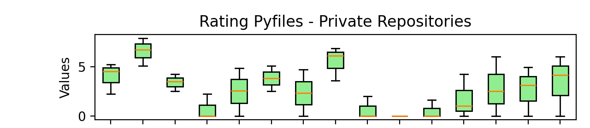
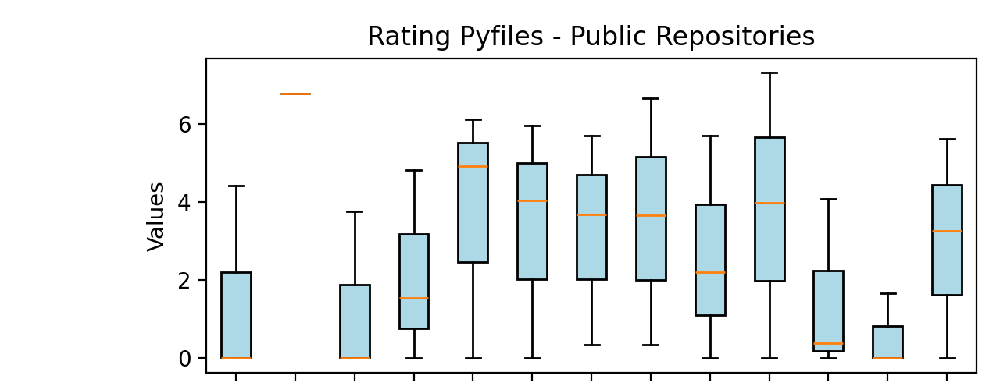
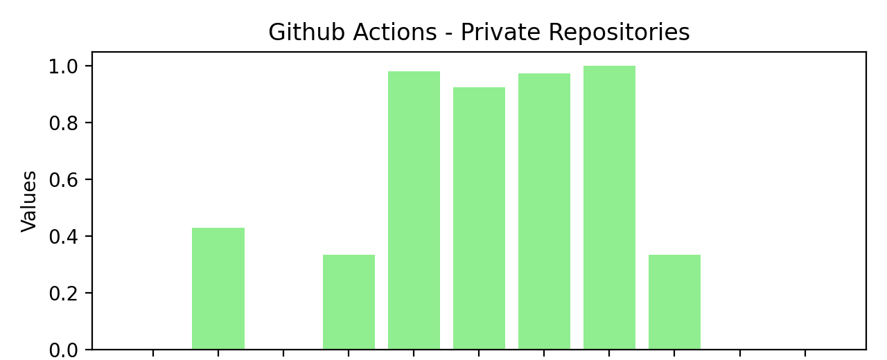
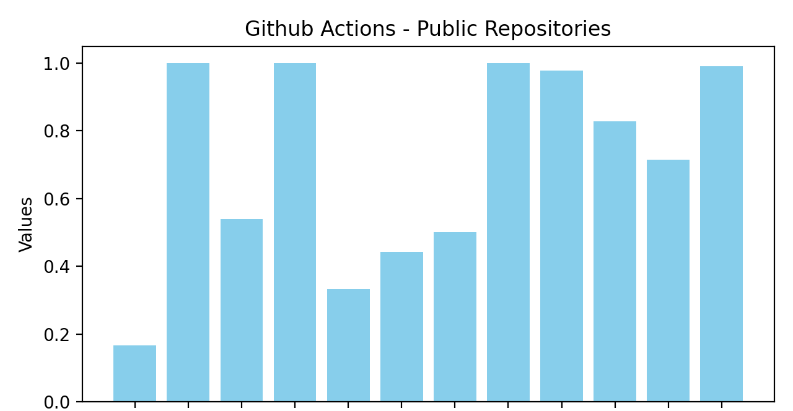

# Results and Analysis 

## Aktivitätsmetriken - Merges to Main

Diese Metrik zeigt, wie oft Änderungen erfolgreich in den Hauptbranch gemerged wurden. Dies ist ein Indikator für ein gesundes Repository.

*Merges to Main - Private Repository*

*Merges to Main - Public Repository*

---

## Qualitätsmetriken - Rating per Pythonfile

Diese Metrik bewertet die Qualität der Python-Dateien in Bezug auf Wartbarkeit und Code-Standards.

*Rating per Python File - Private Repository*

*Rating per Python File - Public Repository*

---

## Workflow-Metriken - GitHub Success Rate

Diese Metrik gibt an, wie oft GitHub Actions Workflows erfolgreich abgeschlossen wurden. Eine hohe Erfolgsrate zeigt ein stabiles Build-System.

*GitHub Success Rate - Private Repository*

*GitHub Success Rate - Public Repository*
